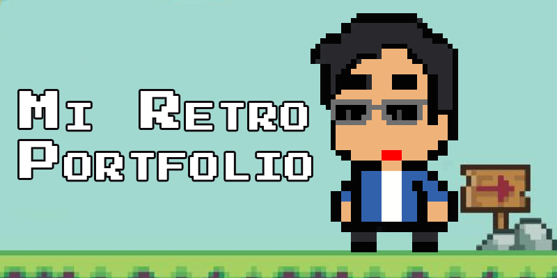

 

<h1 align="center">
Mi Portfolio
</h1>
<h2 align="center">
Diseño retro arcades 100% mio
</h2>
 
 
Para el diseño descargué la fuente "Press_Start_2P" desde la página GOOGLE FONTS.  

Botones estilo arcade diseñados enteramente por mi, porque los que encontré no me gustaron🥱.  
Los SVG son algunos de "Lucide" y otros random y modificados.
 
 
🎨<b>Estilo</b>: Tailwind CSS v4.0 y CSS puro para los botones arcade.  
🛠 <b>Framework</b>: Next.js y React  
📧<b>Api de terceros</b>: SendGrid  
💾<b>Deployed</b>: Vercel desde GitHub

<h2>Acerca de mi:</h2>

Me llamo Alberto Edelmiro Carrizo, y estoy en busca de un puesto de desarrollador Frontend. Aunque no me considero un experto, mi pasión por el desarrollo web, mi compromiso con el aprendizaje continuo y mi dedicación a encarar cada proyecto con responsabilidad y entusiasmo son mis principales motores.

Durante los últimos meses, he adquirido experiencia trabajando con tecnologías como HTML, CSS, JavaScript, React, Next.js y Tailwind CSS. También adquirí experiencia con el CMS de Supabase utilizando las bases de datos relacionales y storage para archivos. Estas herramientas me han permitido llevar a cabo proyectos desafiantes, incluyendo la integración de APIs y el manejo de bases de datos. Cada proyecto ha sido una oportunidad para mejorar mis habilidades técnicas y reforzar mi capacidad para resolver problemas.

Además de mis conocimientos técnicos, tengo una sólida ética de trabajo y una gran adaptabilidad. Mi experiencia previa en Proton SRL como diseñador gráfico y gestión de clientes me ha enseñado a enfrentar desafíos con creatividad y perseverancia.

Estoy buscando un entorno donde pueda aportar mis conocimientos y, al mismo tiempo, seguir aprendiendo de un equipo talentoso. Creo que tu empresa sería un lugar ideal para crecer profesionalmente y contribuir al éxito de sus proyectos.

Te invito a ver mi portfolio:
[Mi Portfolio](https://carrizo-alberto.vercel.app/)
